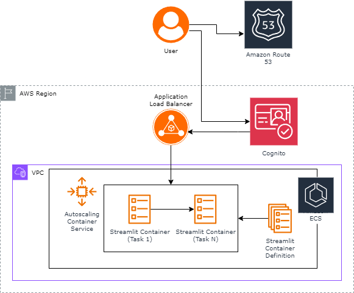

# Streamlit Demo CDK

This CDK is an example of how you can deploy a Streamlit application in AWS. It uses ECS Fargate
for running the application.

Below is a diagram of the archicture used, at a high level:



## Requirements

### Docker

CDK will build the image that will be used by Amazon ECS. You will need Docker to be installed
on the machine building the CDK.

### Route53 Zone

To associate the Amazon Cognito user pool to a domain, we create a custom domain in a Route 53
zone. You will need a Zone ID and a Domain Name to deploy this construct.

### Python Environment
Make sure to setup the `venv` for the CDK, see the instructions in the CDK README.

```shell
python3 -m venv ./cdk/.venv
source ./cdk/.venv/bin/activate
pip install -r cdk/requirements.txt
```

## Deploying

```shell
yarn install
yarn deploy \
    -c zone_id="<Route53 Zone Id>" \
    -c zone_name="<Route53 Domain Name (IE: samples.aws.com)>" \
    -c hostname="<Route53 Hostname for Application (IE: streamlit)>"
```

You can specify a custom AWS Cognito authentication domain prefix:

```shell
yarn install
yarn deploy \
    -c zone_id="<Route53 Zone Id>" \
    -c zone_name="<Route53 Domain Name (IE: samples.aws.com)>" \
    -c hostname="<Route53 Hostname for Application (IE: streamlit)>" \
    -c cognito_domain="<Cognito Domain Prefix (Default: streamlit-auth-[Account ID])>"
```

## Security

See [CONTRIBUTING](CONTRIBUTING.md#security-issue-notifications) for more information.

## License

This library is licensed under the MIT-0 License. See the LICENSE file.